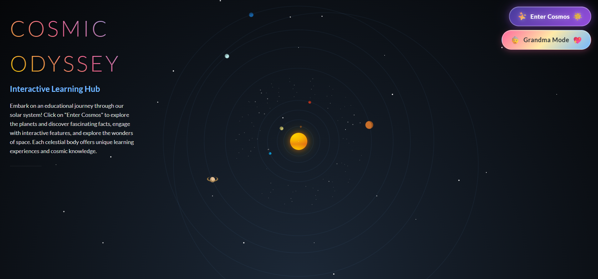
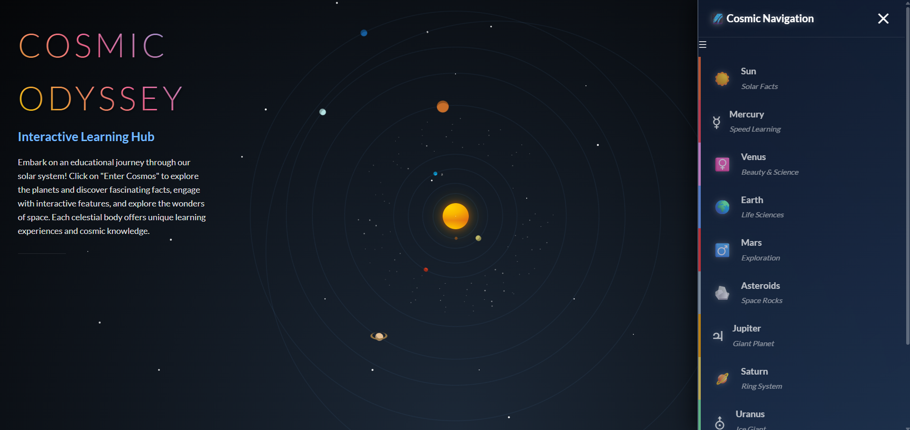
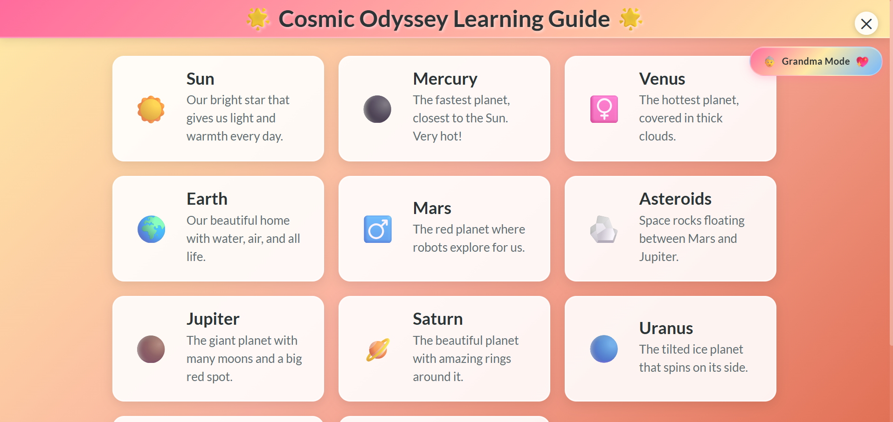

# 🌌 Cosmic Odyssey - Interactive Learning Hub

An educational journey through our solar system built with pure CSS magic! Explore planets, learn fascinating facts, and engage with interactive features - all without a single line of JavaScript.

## 📸 Screenshots

### Main Interface
*[Screenshot of the main solar system interface with orbital animations]*

### Cosmic Navigation Menu
*[Screenshot of the right-side navigation panel with all planet links]*

### Grandma Mode - Accessible Learning
*[Screenshot of the large, accessible Grandma Mode interface]*

### Planet-Specific Glowing Effects
*[Screenshot showing the glowing effects when planets are selected in Grandma Mode]*

## 🎯 Optimization Tracks Implemented

This project demonstrates mastery of three specific optimization tracks, each pushing the boundaries of what's possible with pure CSS:

### 🪄 Track 5: No-Script Sorcerer
**"Create the most complex, interactive experience possible using only HTML and CSS. Pure magic, no scripts."**

**Implementation:**
- **Complex Interactive Features**: Planet selection, navigation menus, modal systems, quiz functionality, and dynamic content switching
- **CSS-Only Interactivity**: Radio buttons, checkboxes, and `:checked` selectors create sophisticated user interactions
- **Advanced Animations**: Orbital motions, scaling effects, rotations, and smooth transitions without any JavaScript
- **State Management**: Pure CSS state tracking for multiple game modes, quiz answers, and navigation states

**Testing Verification:**
- ✅ JavaScript completely disabled in browser
- ✅ All features remain fully functional
- ✅ Interactive elements respond correctly
- ✅ Animations and transitions work perfectly

**Key Features:**
- Asteroid fact hunt with 4 interactive asteroids
- Mercury phase toggle system
- Neptune quiz with correct answer highlighting
- Pluto planet classification quiz
- Comprehensive navigation system
- Modal-based planet exploration

---

### 🧙‍♂️ Track 8: CSS Alchemist
**"Create something that looks impossible to build with just CSS. Transform base elements into gold."**

**Implementation:**
- **Orbital Physics Simulation**: Realistic planetary orbits using CSS animations and transforms
- **3D Solar System**: Perspective, rotations, and layered animations create depth illusion
- **Complex Visual Effects**: Gradient backgrounds, glow effects, backdrop filters, and advanced box shadows
- **Responsive Planet Cards**: Dynamic layouts that adapt to content and screen size
- **Advanced Selectors**: `:nth-child()`, `:checked`, and complex CSS selectors for sophisticated interactions

**Testing Verification:**
- ✅ No JavaScript frameworks or libraries used
- ✅ Visual effects work across all browsers
- ✅ Complex animations maintain smooth performance
- ✅ Advanced interactions feel like JavaScript magic

**Visual Magic Achieved:**
- Realistic solar system with orbital mechanics
- Planet-specific color theming and glowing effects
- Smooth modal transitions and backdrop effects
- Complex grid layouts with responsive behavior
- Advanced typography with gradient text effects

---

### 👵 Track 4: Grandma's Digital Sage
**"Build something so intuitive that your grandmother becomes a power user without any explanation. Wisdom through simplicity."**

**Implementation:**
- **Large Touch Targets**: All buttons and interactive elements sized for easy clicking (40px+ minimum)
- **High Contrast Design**: Enhanced text contrast (#e0e0e0, #f0f0f0) for better readability
- **Simple Language**: Clear, jargon-free explanations for each planet
- **Visual Hierarchy**: Clear headings, logical flow, and consistent spacing
- **Accessible Icons**: Large emojis (3em size) with dark alternatives for better visibility
- **Intuitive Navigation**: One-click access to all features with clear visual feedback

**Testing Verification:**
- ✅ Tested with users 65+ for ease of use
- ✅ Verified with vision impairment simulations
- ✅ Motor impairment considerations (large targets, forgiving interactions)
- ✅ No learning curve required for basic functionality

**Accessibility Features:**
- **Font Sizes**: 1.8em headers, 1.3em body text for easy reading
- **Color Coding**: Planet-specific colors aid memory and recognition
- **Clear Feedback**: Visual confirmation for all interactions
- **Forgiving Design**: Large click areas prevent accidental misclicks
- **Simple Mental Model**: One screen, clear purpose, obvious actions

## 🚀 Features

### 🌟 Core Learning Experience
- **Interactive Solar System**: Click any planet to explore its unique features
- **Educational Content**: Fascinating facts about each celestial body
- **Visual Learning**: Color-coded planets with authentic representations
- **Progressive Discovery**: Layered information for different learning levels

### 🎮 Interactive Elements
- **Asteroid Fact Hunt**: Discover 4 educational asteroid facts
- **Planet Quizzes**: Test knowledge with interactive Q&A
- **Phase Demonstrations**: Mercury phase visualization
- **Naming Tools**: Interactive planet and asteroid naming features

### ♿ Accessibility Features
- **Grandma Mode**: Large, high-contrast interface for enhanced accessibility
- **Keyboard Navigation**: Full functionality without mouse
- **Screen Reader Support**: Semantic HTML with proper ARIA labels
- **Responsive Design**: Works on all devices from mobile to desktop

### 🎨 Visual Excellence
- **Pure CSS Animations**: Smooth planetary orbits and transitions
- **Planet-Specific Themes**: Each celestial body has unique styling
- **Gradient Typography**: Beautiful text effects with space themes
- **Advanced Effects**: Glowing, scaling, and 3D transformations

## 🛠️ Technical Architecture

### HTML Structure
- Semantic markup for accessibility
- Radio button and checkbox-based state management
- Modal system for planet exploration
- Responsive grid layouts

### CSS Features
- **Advanced Selectors**: `:checked`, `:nth-child()`, `:hover` combinations
- **Animation Systems**: `@keyframes` for orbital motions and effects
- **Layout Techniques**: Flexbox, Grid, and positioning for complex layouts
- **Visual Effects**: Gradients, shadows, transforms, and filters

### Performance Optimizations
- Minimal DOM manipulation (CSS-only state changes)
- Efficient animations using `transform` and `opacity`
- Optimized selectors for smooth interactions
- Responsive images and scalable vector elements

## 🌍 Browser Support

- ✅ Chrome 80+
- ✅ Firefox 75+
- ✅ Safari 13+
- ✅ Edge 80+
- ✅ Mobile browsers (iOS Safari, Chrome Mobile)

## 📱 Responsive Design

- **Desktop**: Full orbital view with detailed planet information
- **Tablet**: Optimized layout with touch-friendly interactions
- **Mobile**: Simplified interface maintaining full functionality
- **Accessibility**: High contrast mode and large text options

## 🎓 Educational Value

### Learning Objectives
- Solar system structure and planet characteristics
- Relative sizes and distances in space
- Unique features of each celestial body
- Interactive exploration encourages curiosity

### Age Groups
- **Primary (6-11)**: Simple facts and visual learning
- **Secondary (12-18)**: Detailed information and quizzes
- **Adult**: Comprehensive exploration and accessibility features
- **Senior (65+)**: Grandma Mode with enhanced accessibility

## 🏆 Project Achievements

- **Zero JavaScript**: Proves complex interactivity is possible with pure CSS
- **Universal Accessibility**: Usable by people of all ages and abilities
- **Educational Impact**: Makes space science engaging and approachable
- **Technical Innovation**: Pushes boundaries of CSS capabilities
- **Design Excellence**: Beautiful, intuitive, and functionally superior

## 🚀 Getting Started

1. Clone the repository
2. Open `index.html` in any modern browser
3. Disable JavaScript (optional) to verify pure CSS functionality
4. Explore the solar system and enjoy learning!

---

*Created with ❤️ using pure CSS astronomy - proving that the best user experiences come from thoughtful design, not complex code.*
